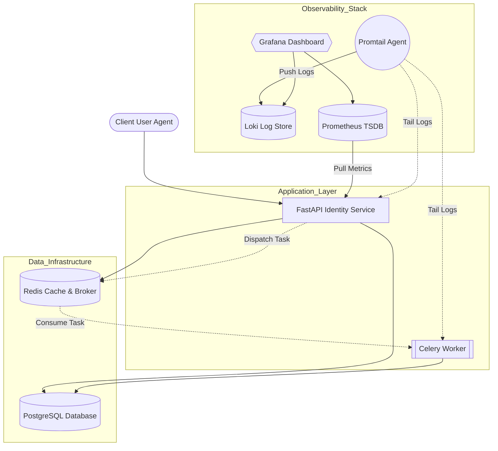

# Identity Management Service

A robust, asynchronous authentication service. This project implements modern OAuth2 standards , rate limiting, and a full observability stack using Infrastructure as Code (IaC) principles.

## System Architecture

The system follows a microservices-ready architecture, utilizing containerization for consistent deployment.



## Key Technical Features

### Security & Authentication

- **OAuth2 Authorization Code Flow with PKCE**: Implements Proof Key for Code Exchange (PKCE) to prevent code interception attacks, ensuring secure mobile and SPA integrations.
- **State Parameter Validation**: Strictly enforces state validation during OAuth2 callbacks to mitigate Cross-Site Request Forgery (CSRF) attacks.
- **Double-Token Architecture**: Utilizes short-lived JWTs for stateless API access and HttpOnly, Secure cookies for refresh tokens to balance security and user experience.
- **Argon2id Hashing**: Industry-standard password hashing configuration.

### Performance & Scalability

- **Background Task Processing**: Decouples blocking operations (email delivery) from the main request-response cycle using Celery and Redis.
- **Database Connection Pooling**: Optimized SQLAlchemy configuration with connection pooling to reduce handshake overhead and manage database load efficiently.
- **Rate Limiting**: Redis-backed sliding window algorithm prevents API abuse and ensures service availability across distributed replicas.

### Observability (PLG Stack)

- **Infrastructure as Code (IaC)**: Grafana dashboards and datasources are automatically provisioned via configuration files, eliminating manual setup.
- **Centralized Logging**: Promtail aggregates container logs to Loki, enabling real-time log querying and correlation with metrics.
- **Business Metrics**: Custom Prometheus exporters track critical KPIs such as login success/failure rates, token refresh latency, and active database connections.


## Project Structure

```bash
.
├── app/                  # Application Source Code
│   ├── api/              # Route Handlers
│   ├── core/             # Security configs (OAuth, PKCE, JWT)
│   ├── services/         # Business Logic
│   └── workers/          # Celery Task Definitions
├── grafana/              # Observability Configuration
│   ├── provisioning/     # Automated setup for Datasources & Dashboards
│   └── dashboards_json/  # Exported Dashboard Models
├── docker-compose.yml    # Orchestration
└── promtail-config.yaml  # Log Shipping Rules
```

## Tech Stack Overview

- **Core**: Python 3.12, FastAPI, Pydantic v2
- **Data Layer**: PostgreSQL 16 (Persistence), Redis 7 (Cache/Broker)
- **Task Queue**: Celery, Flower
- **Monitoring**: Prometheus, Loki, Promtail, Grafana
- **Deployment**: Docker, Docker Compose

## Quick Start

### Prerequisites

- Docker & Docker Compose

## Quick Start

### 1. Configuration

Clone the repository and configure the environment variables:

```bash
cp .env.example .env
```

### 2. Deployment

Start the entire stack (Application, Database, Workers, and Monitoring) in detached mode:

```bash
docker compose up -d
```

### 3. Service Access

| **Service** | **Endpoint** | **Description** |
| --- | --- | --- |
| **API Documentation** | `http://localhost:8000/docs` | Swagger UI |
| **Grafana** | `http://localhost:3000` | Monitoring Dashboard (Default: admin/admin) |
| **Prometheus** | `http://localhost:9090` | Metrics Scraper |
| **Flower** | `http://localhost:5555` | Celery Worker Monitor |

## Monitoring & Troubleshooting

**Accessing Logs:**

Logs are aggregated in Grafana. Navigate to the "FastAPI Identity Monitor" dashboard to view live logs filtered by the application container.

**Worker Status:**

Background task status (Queued, Started, Failed) can be monitored via the Flower interface on port 5555.

**Metrics:**

Business metrics such as `identity_auth_events_total` are available in Prometheus and visualized in Grafana to track authentication health.